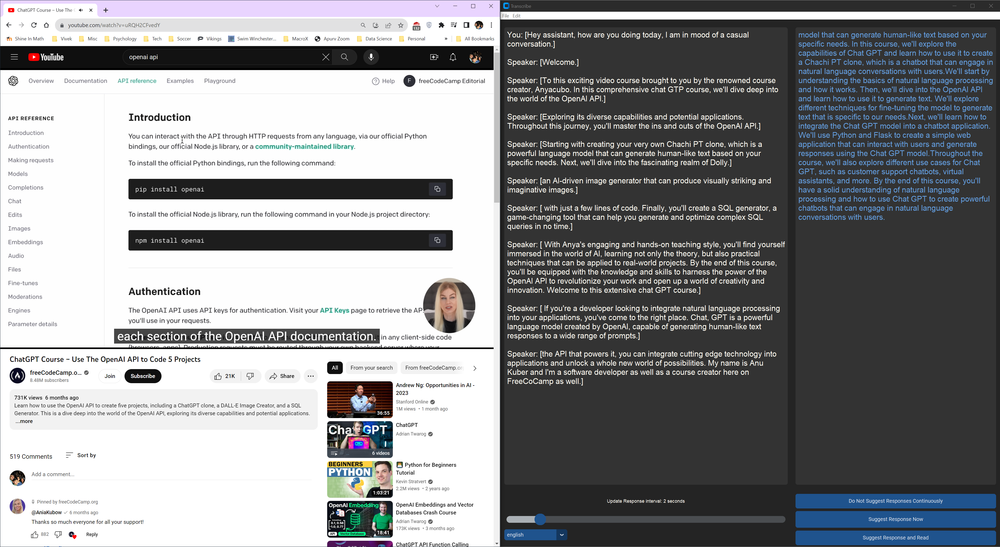

# 👂🏻️ Transcribe ✍🏼️

Transcribe is a live audio, video transcription tool that provides real-time transcripts for the microphone input (You) and the audio output (Speaker). It optionally generates a suggested response using OpenAI's GPT API for the user to say based on the live transcription of the conversation.



##  On Demand Features  ##
We develop mutually beneficial on demand features.

Create an issue in the repo to request on demand features.

## Features ##
- [Response Customization](./docs/ResponseCustomization.md)
- [Audio Customization](./docs/AudioCustomization.md)
- [Speech Mode](./docs/SpeechMode.md)
- [Save Content](./docs/SaveContent.md)
- [Model Selection](./docs/ModelSelection.md)
- [Batch Operations](./docs/BatchOperations.md)
- [Application Configuration](./docs/AppConfig.md)

## Developer Guide ##
[Developer Guide](./docs/ResponseCustomization.md)

## 🆕 Getting Started 🥇

Follow below steps to run transcribe on your local machine.

### 📋 Prerequisites

- Python >=3.11.0
- (Optional) An OpenAI API key (set up a paid [OpenAI account](https://platform.openai.com/))
- Windows OS (Not tested on others as yet)
- FFmpeg

Steps to install FFmpeg on your system.

First, install Chocolatey, a package manager for Windows.

Open PowerShell as Administrator and run the following command:
```
Set-ExecutionPolicy Bypass -Scope Process -Force; [System.Net.ServicePointManager]::SecurityProtocol = [System.Net.ServicePointManager]::SecurityProtocol -bor 3072; iex ((New-Object System.Net.WebClient).DownloadString('https://community.chocolatey.org/install.ps1'))
```
Once Chocolatey is installed, install FFmpeg by running the following command in PowerShell:
```
choco install ffmpeg
```
Run these commands in a PowerShell window with administrator privileges. For any issues during the installation, visit the official [Chocolatey](https://chocolatey.org/) and [FFmpeg](https://ffmpeg.org/) websites for troubleshooting.

### 🔧 Code Installation

1. Clone transcribe repository:

   ```
   git clone https://github.com/vivekuppal/transcribe
   ```

2. Navigate to `transcribe` folder:

   ```
   cd transcribe
   ```

3. Install the required packages:

   ```
   pip install -r requirements.txt
   ```
   
   It is recommended to create a virtual environment for installing the required packages
   
4. (Optional) Provide OpenAI API key in `override.yaml` file in the transcribe directory:

   Create the following section in `override.yaml` file
   ```yaml
   OpenAI:
     api_key: 'API_KEY'
   ```
   Alter the line:
   
      ```
        api_key: 'API_KEY'
      ```
      Replace "API_KEY" with the actual OpenAI API key. Save the file.


### 🎬 Running Transcribe

Run the main script:

```
python main.py
```

For a better version that also transcribes many non English languages, use:

```
python main.py --api
```

Upon initiation, Transcribe will begin transcribing microphone input and speaker output in real-time, optionally generating a suggested response based on the conversation. It might take a few seconds for the system to warm up before the transcription becomes real-time.

The --api flag will use the online whisper api for transcription. This can significantly enhance transcription  accuracy, and it works in many languages (rather than just English without the flag). However, keep in mind, using the Whisper API consumes OpenAI credits and the local model does not consume credits. This increased cost is attributed to the advanced features and capabilities that the Whisper API provides. Despite the additional expense, the substantial improvements in speed and transcription accuracy may make it a worthwhile for your use case.

## ⚡️ Limitations ⚡️

While Transcribe provides real-time transcription and optional response suggestions, there are several known limitations to its functionality to be aware of:

**Whisper Model**: If the --api flag is not used, we utilize the 'tiny' version of the Whisper ASR model, due to its low resource consumption and fast response times. However, this model may not be as accurate as the larger models in transcribing certain types of speech, including accents or uncommon words. Other larger models and their multi lingual versions can be downloaded and used for transcription by following instructions in [Model Selection](./docs/ModelSelection.md) section. Larger models provide better quality transcription and they have higher memory requirements.

**OpenAI Account**: If a paid OpenAI account with a valid Open API Key is not used, the command window displays the following error message repeatedly, though the application behvaior is not impacted in any way.
```
Incorrect API key provided: API_KEY. You can find your API key at https://platform.openai.com/account/api-keys.
```

**Language**: If you are not using the --api flag the Whisper model used in Transcribe is set to English. As a result, it may not accurately transcribe non-English languages or dialects. 

## 👤 License 📖
This project is licensed under the MIT License - see the [LICENSE](LICENSE) file for details.

## ➕ Enhancements from base repository ➕
- Do not need Open AI key, paid OpenAI account to use the complete functionality


## 🤝 Contributing 🤝

Contributions are welcome! Open issues or submit pull requests to improve Transcribe.
